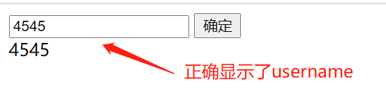
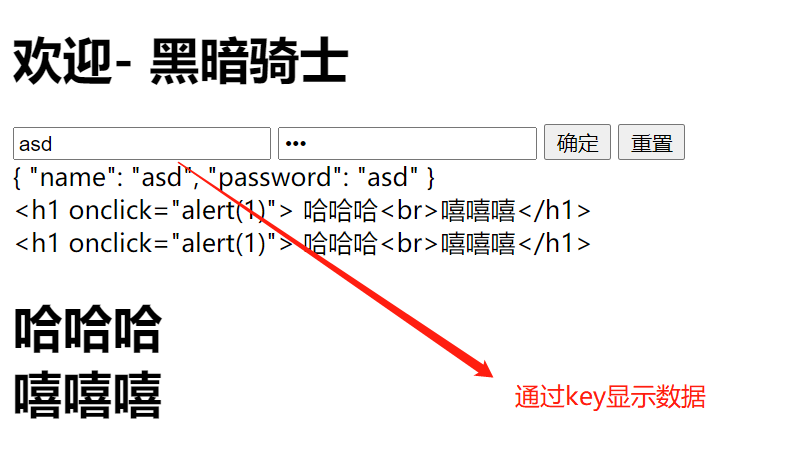
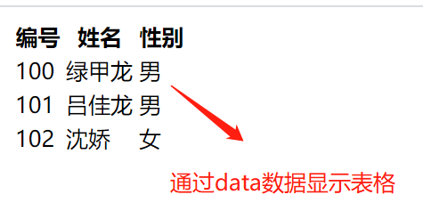
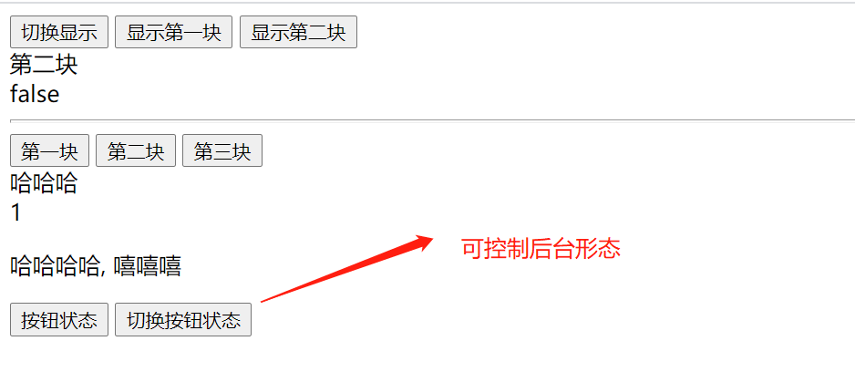
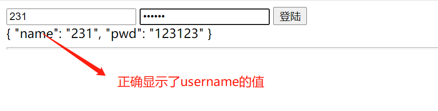

# vue超链接跳转作业

- [vue对照](../vue01.html)

- [vue数据课程一](../vue02.html)

-[vue数据表格，对照组](../vue03.html)

-[vue基本指令](../vue04.html)

-[vue基本指令三](../vue05.html)

-[vue基本指令三](../vue06.html)

-[vue基本指令四](../vue07.html)

-[vue控制样式](../vue08.html)

-[vue计算属性和简体](../vue09.html)

-[vue配合bootstrap样式](../vue10.html)
